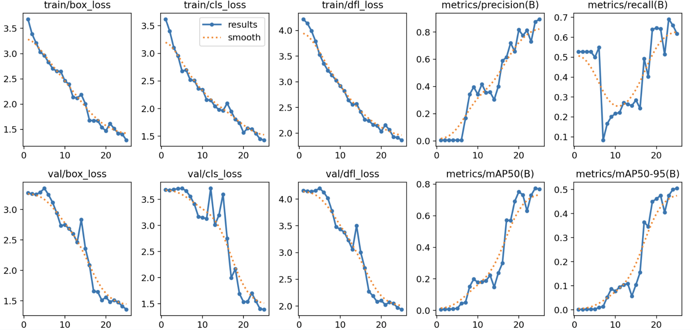
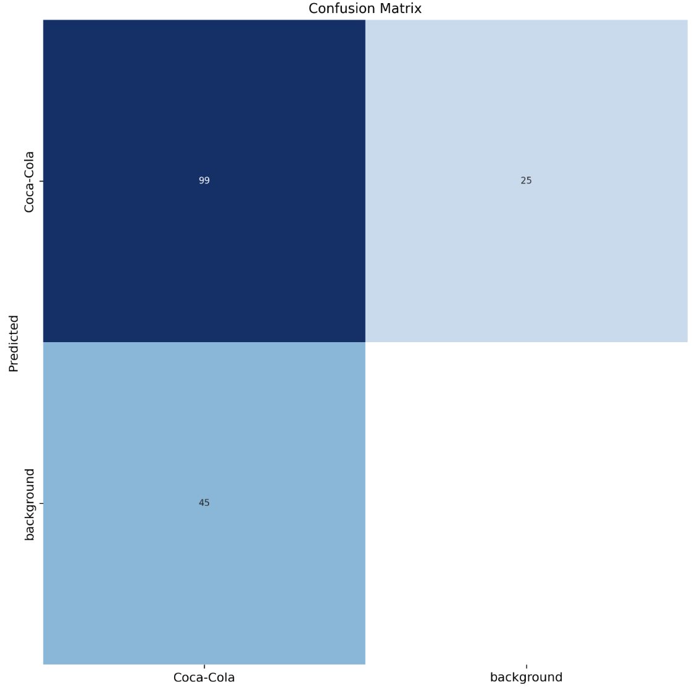
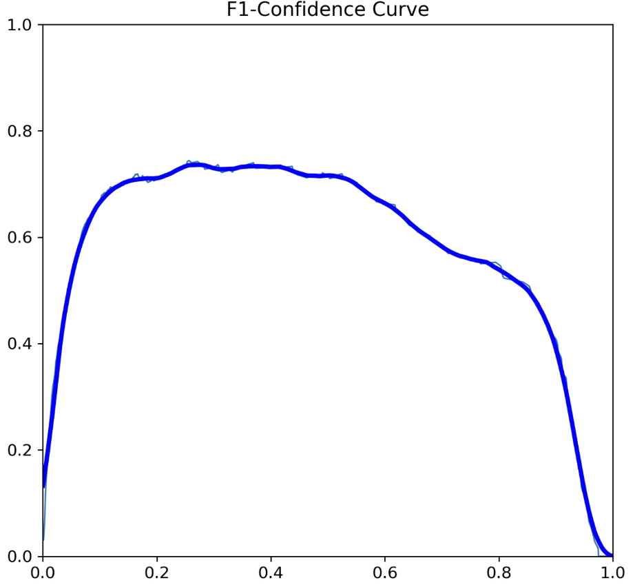

# coca-cola-detection
Implementing Yolov8 developed by Ultrapytics to detect a can of coca-cola in an image and video.

<div>
<a href="https://colab.research.google.com/github/17yo17/coca-cola-detection/blob/main/Coca_Cola_DetectionYOLOv8.ipynb"></a>
</div>

## <div align="center"> Try my Coca-Cola Model</div>

<div align="center">
  <p>  
    <a>
      
    </a>
  </p>
</div>
  
## <div align="center"> Training Procedure Visualization</div>

<div>
  <p>
    <a>
      
    </a>
  </p>
</div>

## <div align="center">Confusion Matrix & F1 Confidence Curve</div>
<div align="center">
  <p>
    <a>
      
    </a>
    <a>
      
    </a> 
    
  </p>
</div>

<details open>
<summary>Performance Metrics</summary>
  
| Metrics  |   mAP  | Precision | Recall |
| -------- | ------ | --------- | ------ |
|          | 81.3%  | 90.6%     | 70.1%  |
</details>


# Coco-Cola Detection with YOLOv8
## Steps
## Requirements
- Python >= 3.8
- GPU (recommended for faster training)
- `NVIDIA GPU` with `CUDA` support (for GPU acceleration)
- External libraries: `Ultralytics`, `Roboflow`, `PyTorch`, `CUDA` (if using GPU), etc.
## Installation
- Create virtual environment with Python >= 3.8 (preferably)
- Clone the Ultralytics repository:
```
!git clone https://github.com/ultralytics/ultralytics.git
```
- Install `Ultralytics` and `Roboflow` dependencies:
```
%pip install ultralytics==8.0.196
%pip install roboflow
```

## Usage
### Data Preparation:
- Create an account on Roboflow (https://roboflow.com/). You can either download the publicly available annotated dataset on Roboflow or manually annotating your images using Roboflow tools

- Not required, but you can use Roboflow’s data augmentation & preprocessing techniques (rotation, scaling, flipping, color adjustments etc.) to make the dataset more diverse.

- Once your dataset is uploaded and annotated (or you already picked a public dataset to download), export them in the format compatible with your framework ( YOLO, TensorFlow, PyTorch, etc.)

- In the cloned repository (Installation part) there’s a file called `data.yaml` where you can specify the path to your exported dataset. In the file there should be partitions (titles) under names `test`, `train`, and `val` (stands for valid). Add in the path to folders containing images for their respective purposes. You can also specify relative paths to the dataset from the `data.yaml` file like the example below: 
```
test: ../test/images
train: ../train/images
val: ../valid/images
```
- Now, create a new python file you would use for loading up datasets and train your model with it. Name it however you want. In the file:

    **Build A Model**
        - pick your base model...
<details open>
<summary>Detection (COCO)</summary></summary>
  
| Model                                                                                | size<br><sup>(pixels) | mAP<sup>val<br>50-95 | Speed<br><sup>CPU ONNX<br>(ms) | Speed<br><sup>A100 TensorRT<br>(ms) | params<br><sup>(M) | FLOPs<br><sup>(B) |
| ------------------------------------------------------------------------------------ | --------------------- | -------------------- | ------------------------------ | ----------------------------------- | ------------------ | ----------------- |
| [YOLOv8n](https://github.com/ultralytics/assets/releases/download/v8.1.0/yolov8n.pt) | 640                   | 37.3                 | 80.4                           | 0.99                                | 3.2                | 8.7               |
| [YOLOv8s](https://github.com/ultralytics/assets/releases/download/v8.1.0/yolov8s.pt) | 640                   | 44.9                 | 128.4                          | 1.20                                | 11.2               | 28.6              |
| [YOLOv8m](https://github.com/ultralytics/assets/releases/download/v8.1.0/yolov8m.pt) | 640                   | 50.2                 | 234.7                          | 1.83                                | 25.9               | 78.9              |
| [YOLOv8l](https://github.com/ultralytics/assets/releases/download/v8.1.0/yolov8l.pt) | 640                   | 52.9                 | 375.2                          | 2.39                                | 43.7               | 165.2             |
| [YOLOv8x](https://github.com/ultralytics/assets/releases/download/v8.1.0/yolov8x.pt) | 640                   | 53.9                 | 479.1                          | 3.53                                | 68.2               | 257.8             |

</details>

  ```
  model = YOLO("YOUR_BASE_MODEL") 
  ```
  
   **Training:**
        - Use the train function to train the model on your dataset. Adjust parameters like batch size, epochs, and device according to your hardware capabilities.
        - Example: 
        ```
        model.train(data=data_path, batch=32, epochs=25, device=2, val=False)
        ```
  
  **Initializing the YOLOv8 model with pre-trained weights:** 
    - `best.pt`: This file represents the model's weights that achieved the best performance on a validation set during training
    - Example: 
    ```
    model = YOLO("PATH/TO/train/weights/best.pt")
    ```
    This step sets up the model for training, evaluation, or deployment on specific tasks and datasets.
    `Note`: Before this we defined `data_path = "<path/to/your/data.yaml/file>"`
  
  **Model Evaluation:**
        - After training, evaluate the model's performance using the val function with validation data.
        - Example: 
        ```
        model.val(data=data_path)
        ```
  
  **Model Tuning:**
    - Fine-tune the trained model using the tune function. Adjust parameters as needed.
    - Example: 
    ```
    model.tune(data=data_path, epochs=20, iterations=50, optimizer='AdamW', plots=False, save=False, val=False)
    ```
    
   **Testing:**
    - Test the deployed model on a set of images using the predict function.
    - Example:
    ```
    model.predict(data=data_path, conf=0.5, source=test_set, save=True)
    ```
    
  **Model Deployment:**
    - Once satisfied with the model, deploy it to Roboflow using the deploy function.
    - Example:
    ```
    project.version(dataset.version).deploy(model_type="yolov8", model_path=f"PATH/TO/runs/detect/train OR tune/")
    ```

  **Real-time Detection:**
    - Utilize the model for real-time object detection using a webcam.
    - Example:
    ```
    webcam = model(source=0, save=False, show=True)
    ```
    - setting `save` to `False` avoids from retaining all the images passed on.
    - `source=0`: This parameter specifies the video source → `0` if you want to use the default webcam connected to the PC/laptop you’re running this model on. If you have multiple cameras you can specify a different index to select a different camera.

- Notes:
    - Ensure that the paths to data, trained, and tuned models are correctly specified.
    - Experiment with different parameters for training, tuning, and prediction based on your requirements and hardware capabilities.
    - References: 
        - [Ultralytics GitHub Repository](https://github.com/ultralytics/ultralytics)
        - [Roboflow Documentation](https://docs.roboflow.com/)
        - [YOLOv8 Paper](https://arxiv.org/abs/2104.02194)

